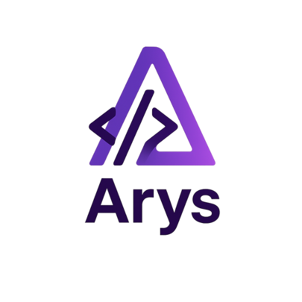
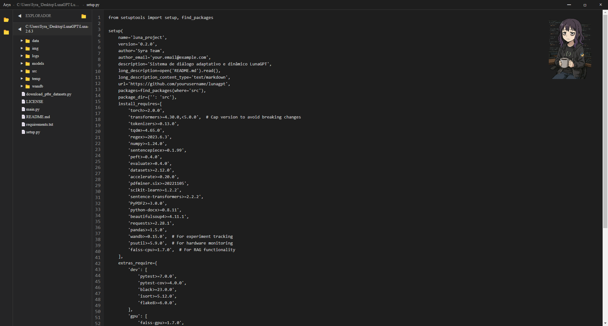

# Arys Editor


Arys é um editor de código moderno, multiplataforma e open source, inspirado nos melhores editores do mercado. Ele oferece destaque de sintaxe para várias linguagens, preview de Markdown, suporte a PDF, gerenciamento de arquivos e uma interface amigável com mascote interativo.

---

## ✨ **Principais Funcionalidades**

- **Destaque de Sintaxe** para Python, JavaScript, HTML, CSS, JSON, Markdown, e mais.
- **Preview de Markdown** em janela interna.
- **Visualização de PDF** integrada.
- **Gerenciador de Arquivos** com árvore de navegação e contexto.
- **Mascote Dinâmico** que reage ao uso.
- **Janelas internas** para preview, câmera e formulários.
- **Modo escuro** e interface moderna.
- **Atalhos e menus contextuais** para produtividade.
- **Builds para Windows e Linux** (AppImage, deb, Portable, NSIS).

---

## 🚀 **Como rodar localmente**

### Pré-requisitos

- [Node.js](https://nodejs.org/)
- [npm](https://www.npmjs.com/)
- [Docker](https://www.docker.com/) (para builds Linux no Windows)

### Instalação

```bash
git clone https://github.com/seu-usuario/arys.git
cd arys
npm install
```

### Rodando em modo desenvolvimento

```bash
npm start
```

---

## 🐧 **Build para Linux (usando Docker no Windows)**

```bash
npm run build:linux
```
Os arquivos `.AppImage` e `.deb` serão gerados na pasta `dist/`.

---

## 🪟 **Build para Windows**

```bash
npm run build:win
```
O instalador `.exe` será gerado na pasta `dist/`.

---

## 📁 **Estrutura de Pastas**

```
build/icons/         # Ícones em múltiplos tamanhos
imgs/                # Imagens do mascote e outros assets
src/                 # (opcional) Código fonte JS/CSS
index.html           # Interface principal
main.js              # Processo principal Electron
package.json         # Configuração do projeto
```

---

## 🖼️ **Ícones**

- PNGs: 512x512, 256x256, 128x128, 64x64, 48x48 (em `build/icons`)
- Windows: `build/icon.ico` (multi-resolução)
- (Opcional) macOS: `build/icon.icns`

---

## 📋 **Licença**

Este projeto é open source. Escolha e adicione sua licença preferida (MIT, GPL, etc).

---

## 🙏 **Contribua**

Pull requests, sugestões e issues são bem-vindos!

---

## 📷 **Screenshots**



---

**Desenvolvido com ❤️ por Syra Team**
